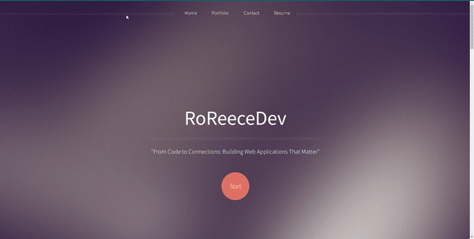

# My Portfolio

[Portfolio](https://roreecedev.netlify.app/)

## Hello All, I Am Rochelle Reece

Software Engineer | Black Female Feminist | @ResilientCoders Alum | Mental Health Advocate | From Code to Connections: Building Web Applications That Matter

## About Me 

My journey as a software engineer is fueled by my personal experiences with mental health challenges in the Black community and my own family, driving me to break the stigma and make a positive impact. 

I have successfully leveraged my software engineering skills to build web applications that connect people of color with mental health professionals who can truly relate to their experiences. I've created a welcoming and safe space where people of color feel comfortable seeking the support they deserve, especially in places where it's not readily available.

Through my journey, I aim to demonstrate that adversity can serve as a wellspring of strength and that technology has the potential to be a powerful force for positive change within our communities. Armed with unwavering dedication and the right tools, we have the capacity to surmount even the most formidable obstacles, leaving a profound and enduring mark for the better. Let's unite through code, forging meaningful connections and developing web applications that truly make a difference!

### CREDITS 

Template: 
    Helios by HTML5 UP
	html5up.net | @ajlkn
	Free for personal and commercial use under the CCA 3.0 license (html5up.net/license)
Icons:
	Font Awesome (fontawesome.io)
	Icons8 (https://icons8.com/)(CSS3, JS, Panda, and HTML5)
Other:
	jQuery (jquery.com)
	Scrollex (github.com/ajlkn/jquery.scrollex)
	Responsive Tools (github.com/ajlkn/responsive-tools)